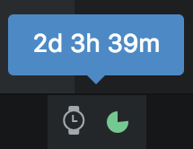

# time-tracer

Atomatic time tracking powered by any command line tool (default is [watson](http://tailordev.github.io/Watson/)) for Atom.
Never again forget starting or stopping the timer!

## Features

- you choose what time tracking tool is used in the background
- global and project specific configuration options
- use the power of NodeJS to fully customize command arguments
- starts tracking time automatically when you work in Atom
- stops tracking time when you're inactive in Atom
- stops tracking when your machine goes to sleep
    - currently only macOS is supported without any extra work (see [Installation](#installation))
- upon Atom window switch tracking is also switched from the previous project to the current window's one
- check your stats
    - overall in the status bar
    - by day and tag using the `report` command
- keep tracking your time while you're in a meeting (using the `meeting` command)
    - a `meeting` tag is added to your current project tracking by default
    - you can specify another project in the appearing in-Atom lock-screen
    - hit `escape` to cancel

## Installation

```bash
apm install time-tracer
# on macOS (see https://tailordev.github.io/Watson/#installation for more details)
brew install watson
```

If you're not on macOS and want to enable automatically stop tracking
when your machine goes to sleep, you have to install a command line tool
of your choice on your user's shell `$PATH` and add the tool's name to the
`sleep watcher` setting.

## Usage

This package tracks your interactions in Atom.
Whenever you do something actively a timer is started.
The timer stops if you haven't done anything in a while.

Since everything is configurable you can use this package with any time
tracking tool you want.
Most of the configuration is done in Atom's settings panel.
But project-specific settings can be defined in a `timetracer.config.js` file.
See section [Configuration](#timetracer.config.js) for more details.

### Status bar

Unless disabled, there is a status bar tile which shows a watch and the time until the timer
will be stopped (using a mini pie chart).
On hover the time spent on the project is displayed (days mean work days - the amount of hours per work day can be configured).
On click a chart is displayed showing how much you worked on what tags.



## Configuration

### Atom settings

See the [config](https://github.com/jneuendorf/atom-time-tracer/blob/master/src/config.js) for details.

### `timetracer.config.js`

This file can and should be used to add/overwrite project specific settings.
All keys of the Atom settings may be overwritten.
See the [example config file](https://github.com/jneuendorf/atom-time-tracer/blob/master/timetracer.config.js).

Additionally, the `name` and `tags` properties may be defined.
`name` equals `%project` (default is all project folder names joined by `__`) and `tags` equals `%tags` (default `''`) in the command settings.

Since the config file is a JS file you can dynamically generate tags.
You could for example use the staged files as tags to see how long you've approximately worked on certain files.

### UI tweaks

As always, you can use your Atom's `styles.less` to customize this package's style.
For example, if you want only part of the status bar tile to be rendered, you can hide the others.
In this case you should use the following selectors:

```less
.status-bar {
    .time-tracer {
        .icon {}
        .timer {}
        .project-name {}
    }
}
```

## Thanks to

- [Akuma901](https://github.com/Akuma901) and his [time tracker](https://github.com/Akuma901/atom-time-tracker)
  for inspiration for the status bar tile
